# The Elm Architecture

## Overview

The Elm Architecture (TEA) is the mandatory pattern that every Elm application is built on. It is not a framework, a library, or a convention that developers choose to follow; it is the only way to structure an Elm application [1].

TEA emerged from Elm itself. Evan Czaplicki did not design it from the outset as a separate abstraction; it evolved naturally from the constraints of a purely functional, immutable language. Elm's prohibition of mutable state and side effects in user code meant that a structured way of managing state changes was essential, rather than being a matter of choice in the design process [1][2].

## The Three Parts

Every Elm application consists of exactly three parts: **Model**, **Update**, and **View**. They form a loop that the Elm runtime drives continuously [1].



### 1. Model

The Model is the definitive source of information for the complete application state. Everything the application needs to remember between interactions lives here - nothing more, nothing less [1].

```elm
-- A counter: the entire state is a single integer
type alias Model = Int

init : Model
init = 0
```

```elm
-- A form: the state is a record grouping related fields
type alias Model = { 
    username : String,
    password : String,
    submitted : Bool
}
```

Since values in Elm are immutable, the Model is never modified directly. The `update` function always produces a new Model based on the existing one [2]. See [01-counter/Main.elm](../examples/01-counter/Main.elm) for the simplest possible Model - a plain `Int`.

### 2. Msg

The `Msg` type is custom-defined and lists every possible action that can be triggered by the user system. The pattern matching in `update` is exhaustive - the compiler will not accept a program that fails to handle every variant [1].

```elm
type Msg
    = Increment
    | Decrement
    | Reset
```

Naming is important. `Msg` variants describe *what has happened*, not *what should happen*. `UserClickedButton` or `Increment` clearly communicate intent. Imperative names such as `DoIncrement` are discouraged because they conflate the event with the response [1].

### 3. Update

The `update` function is the only place where state transitions occur. It takes the current Model and a Msg, and returns a new Model. It is a pure function, meaning there is no mutation, side effects or hidden state [1][2].

```elm
update : Msg -> Model -> Model
update msg model =
    case msg of
        Increment ->
            model + 1

        Decrement ->
            model - 1

        Reset ->
            0
```

Because `update` is pure, every state transition can be tested in isolation. Given the same Model and Msg, `update` always returns the same new Model. There is no way for external state to affect the result.

The `case` expression must cover all `Msg` variants. If a new variant is added and `update` is not updated accordingly, the program will not compile.

### 4. View

The `view` function takes the current Model and returns `Html Msg` - a description of what the UI should look like and where each interactive element can emit a `Msg` when triggered [1].

```elm
view : Model -> Html Msg
view model =
    div []
        [ h1 [] [ text (String.fromInt model) ]
        , button [ onClick Decrement ] [ text "-" ]
        , button [ onClick Reset ]     [ text "Reset" ]
        , button [ onClick Increment ] [ text "+" ]
        ]
```

The view is a pure function. The same Model always produces the same HTML. There is no imperative DOM manipulation - the Elm runtime compares the previous and current virtual DOM trees, applying only the necessary changes [1].

## The Runtime Loop

The Elm runtime is responsible for connecting the three components. The developer never calls `update` or `view` directly - the runtime does this instead [1]:

1. The app starts with `init`, which sets the initial Model.
2. The runtime calls `view` with the current Model to render the UI.
3. When the user interacts with the UI, a `Msg` is emitted.
4. The runtime calls `update` with the current Model and the `Msg`.
5. `update` returns a new Model.
6. The runtime calls `view` again with the new Model.
7. The cycle repeats.

The entry point is `Browser.sandbox`, which connects these three elements for straightforward applications without side effects:

```elm
main : Program () Model Msg
main =
    Browser.sandbox
        { init = init
        , update = update
        , view = view
        }
```

See [01-counter/Main.elm](../examples/01-counter/Main.elm) and [02-traffic-light/Main.elm](../examples/02-traffic-light/Main.elm) for complete, working examples of `Browser.sandbox`.

## Extending TEA: Commands and Subscriptions

`Browser.sandbox` is sufficient for entirely self-contained applications. However, as soon as an application needs to communicate with the outside world - for example, by making an HTTP request, reading from `localStorage` or listening to a timer - the runtime loop must be extended with `Cmd` and `Sub` [1].

### Commands (Cmd)

A `Cmd` is a value that describes an action that the Elm runtime should perform on behalf of the application. `update` returns a `(Model, Cmd Msg)` pair instead of just a `Model` [1].

```elm
update : Msg -> Model -> ( Model, Cmd Msg )
update msg model =
    case msg of
        FetchWeather city ->
            ( { model | state = Loading city }
            , Http.get
                { url = buildUrl city
                , expect = Http.expectJson (GotWeather city) temperatureDecoder
                }
            )

        GotWeather city (Ok temperature) ->
            ( { model | state = Loaded city temperature }, Cmd.none )

        GotWeather city (Err error) ->
            ( { model | state = Failed city (httpErrorToString error) }, Cmd.none )
```

The `Http.get` call does not perform the request immediately; instead, it returns a `Cmd` value that describes the request. The Elm runtime then executes the request asynchronously and delivers the result back as a `Msg`. User code never touches the network directly. See [05-weather-app/Main.elm](../examples/05-weather-app/Main.elm) for a complete HTTP example.

### Subscriptions (Sub)

A `Sub` instructs the Elm runtime to listen out for events from the outside world and deliver them as messages. Common sources include timers, WebSocket messages, and incoming port data [1].

```elm
subscriptions : Model -> Sub Msg
subscriptions _ =
    loadNote NoteLoaded
```

The `subscriptions` function is called with the current Model after every update, meaning that active subscriptions can change based on the state of the application. In [04-ports-localstorage/Main.elm](../examples/04-ports-localstorage/Main.elm), it is the incoming `loadNote` port subscription that allows JavaScript to push the stored note into Elm on startup.

### Browser.element

Applications that use `Cmd` or `Sub` must use `Browser.element` instead of `Browser.sandbox`. This requires two additional pieces:

- `init` returns `(Model, Cmd Msg)` - an initial command can be issued on startup.
- A `subscriptions` function is required.

```elm
main : Program () Model Msg
main =
    Browser.element
        { init = init
        , update = update
        , view = view
        , subscriptions = subscriptions
        }
```

[04-ports-localstorage/Main.elm](../examples/04-ports-localstorage/Main.elm) and [05-weather-app/Main.elm](../examples/05-weather-app/Main.elm) both use `Browser.element` for this reason.

## Why This Architecture Works

TEA solves the core problems of front-end state management by enforcing a set of structural constraints [1][2]:

**A single source of truth.** All state lives in the Model. There are no hidden component states, no global variables, no synchronisation problems between disparate pieces of state.

**Unidirectional data flow.** State can only change through `update`. The direction of change is always the same: Msg in, new Model out. There are no two-way bindings, no cascading updates triggered by side effects.

**Explicit state transitions.** Every possible action is declared as a `Msg` variant. Every transition is a branch in `update`. The compiler verifies that all cases are covered. Adding a new action requires updating `update`, and the compiler will report any missing cases.

**Separation of concerns.** The `view` is purely a function of the Model. It cannot mutate state. The `update` function never touches the DOM. The Model holds no rendering logic. Each of the three parts has a single, clearly bounded responsibility.

## Sources

[1] Czaplicki, E. *An Introduction to Elm*. Official Elm Guide.
    https://guide.elm-lang.org/architecture/

[2] elmprogramming.com. *The Elm Architecture*.
    https://elmprogramming.com/elm-architecture.html

---
<sub>Previous | [Core Concepts](02-core-concepts.md)</sub> &nbsp;&nbsp;&nbsp; <sub>Next | [Elm Ecosystem](04-elm-ecosystem.md)</sub>