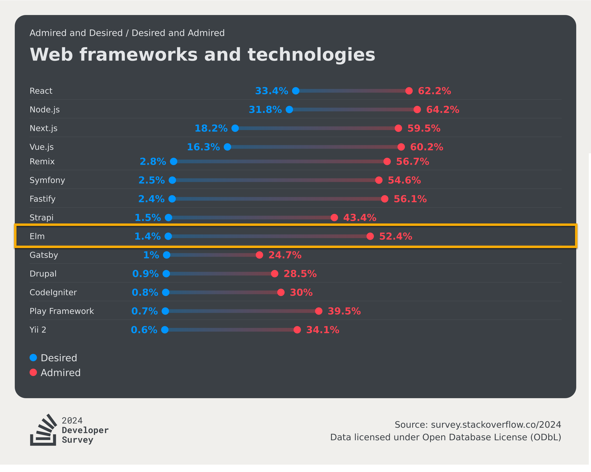

# When Elm Is a Good Choice

The comparisons in this section have established a consistent picture of what Elm costs and what it provides in return: type safety without escape hatches, an enforced architecture, a bounded language surface, and a port-based boundary with JavaScript. Each of these is simultaneously a constraint and a guarantee.

Whether those guarantees are worth their cost is not a universal question. It depends on what the project needs, what the team looks like, and what the failure modes are most expensive. This file identifies the conditions under which Elm's trade-offs work in its favor.

---

## Applications with Complex, Long-Lived UI State

The clearest case for Elm is an application where the UI state is genuinely complex and the application will be maintained over a significant period of time.

The [comparison with JavaScript](02-elm-vs-javascript.md) established that JavaScript imposes no structure on state management. State can live anywhere, be mutated from anywhere, and the cost of that flexibility compounds as an application grows. The [comparison with React and TypeScript](03-elm-vs-typescript-frameworks.md) showed the same problem at the framework level: React is a rendering library, not a state management solution, and the choices a team makes about state organisation are not enforced by the language or the runtime.

Elm's enforced The Elm Architecture means that in any Elm codebase, regardless of size or contributor count, there is exactly one place where state lives and exactly one function through which it can change. The prototype demonstrates this directly: a ticket system with tickets, filters, search, form state, selected ticket, and validation errors all coexist in a single `Model`, and every change is traceable to a single `update` function. Adding a new state concern does not require deciding where it goes, because there is only one answer.

For applications where understanding why the UI is in a particular state is a recurring debugging task, this constraint eliminates an entire category of maintenance work.

---

## Projects Where Reliability Is a Hard Requirement

Elm eliminates at compile time the categories of error that cause the most common production failures in JavaScript applications: null reference errors, unhandled case branches, type mismatches, and missing validation on external data.

The [comparison with JavaScript](02-elm-vs-javascript.md) catalogued these error categories in detail. The [comparison with TypeScript](03-elm-vs-typescript-frameworks.md) showed that TypeScript reduces but does not eliminate them, because the reduction depends on strict mode configuration, the absence of `any`, and consistent team discipline. Elm's guarantees are unconditional. A program that compiles has these error categories structurally ruled out, not just reduced by convention.

[Example 02](../examples/02-traffic-light/README.md) illustrates the exhaustiveness guarantee concretely. The traffic light's `update`, `lightColor`, and `label` functions each pattern match on `TrafficLight`. Adding a `Flashing` variant without updating all three produces a compile error, not a warning, not a runtime failure discovered in testing. The prototype applies the same principle to `TicketStatus`: every place in the codebase that handles a status variant must handle all of them.

For applications where a production runtime error has a meaningful cost, such as internal tooling used by many people, customer-facing systems, or applications in regulated environments, this structural guarantee has compounding value over the life of the application.

---

## Teams Willing to Front-Load the Learning Investment

The comparison files were consistent: Elm has a steep initial learning curve. Functional programming, a static type system, and The Elm Architecture are unfamiliar to most developers coming from a JavaScript or TypeScript background. The initial productivity dip is real and should not be understated.

The other side of that picture is equally consistent: Elm's language surface is finite and does not grow. There are no competing state management libraries to evaluate, no architectural patterns to debate, no configuration options for the type system. Once a developer understands TEA and the type system, they understand the entire structure of any Elm application.

The Stack Overflow Developer Survey 2024 captures this gap precisely. Elm was used by only 1.4% of respondents, yet 52.4% of those who had used it said they wanted to continue using it, placing it among the most admired frameworks in the survey despite its negligible adoption rate.

(Note: this image has intentionally been cropped to only include the top and bottom parts of the survey. For the full graphic, follow the source)

This means the developers who commit to Elm tend to find the investment worthwhile. The low adoption figure reflects the upfront cost, and the high admiration figure reflects what is on the other side of it.

This makes Elm a strong fit for teams that are prepared to invest in a defined learning period before the productivity benefits materialise. A team that treats the initial learning cost as a one-time investment, rather than an ongoing burden, is positioned to benefit from the stability that follows.

---

## Educational and Architecture-Driven Contexts

Elm occupies an unusual position among frontend languages in that it was designed with teachability as an explicit goal. The language has no inheritance, no implicit conversions, no exceptions, no mutation, and no null. Every concept in the language is explicit and traceable.

This makes it a strong fit for contexts where the goal is not only to build something but to understand the principles behind what is being built. [Example 01](../examples/01-counter/README.md) demonstrates the entire Elm Architecture in under fifty lines. [Example 03](../examples/03-temperature-converter/README.md) shows how the `Maybe` type forces explicit handling of absent values in a way that is impossible to accidentally skip. [Example 04](../examples/04-ports-localstorage/README.md) shows exactly what it costs to communicate with JavaScript, and why that cost exists. None of these lessons require a large or complex codebase.

For courses, training programs, teams building internal tooling with a secondary goal of developing architectural thinking, or projects where the code itself is intended to serve as documentation of functional programming principles, Elm provides a rare combination: a real, working language with a deliberately limited surface that does not hide its own design decisions.

---

## Small Teams Where Architectural Consistency Matters More Than Hiring Pool Size

The team suitability findings across all three comparison files were consistent. Elm developers are rare, and onboarding a developer without a functional programming background requires a genuine investment. For large teams or organisations where the ability to hire from a broad pool is a hard constraint, this is a significant drawback.

For small teams of two to four developers, the picture changes. A small team can make a deliberate decision to adopt Elm, invest in the learning period together, and then benefit from a codebase where every contributor works within the same enforced structure. Because all Elm applications follow TEA, a developer familiar with the pattern can read any Elm codebase and understand its structure immediately. In React, the same is not true.

The [comparison with React and TypeScript](03-elm-vs-typescript-frameworks.md) noted that React's flexibility means architectural decisions are deferred and eventually need to be made or revisited. In a small team without a strong senior voice enforcing conventions, that flexibility tends to produce inconsistency over time. Elm removes that category of decision entirely.

---

## Summary

| Condition                                                            | Why Elm fits                                                                                         |
| -------------------------------------------------------------------- | ---------------------------------------------------------------------------------------------------- |
| Complex UI state that must remain predictable over time              | TEA enforces a single location for state and a single path for changes                               |
| High reliability requirement with low tolerance for runtime failures | Compile-time elimination of null errors, unhandled cases, and type mismatches                        |
| Team prepared to invest in a defined learning period                 | Finite language surface, high admiration rate among actual users, no ongoing architectural decisions |
| Educational or architecture-driven project                           | Explicit design, teachable concepts, examples that demonstrate principles directly                   |
| Small team where consistency matters more than hiring breadth        | Enforced structure means any contributor can read any part of the codebase immediately               |

Elm is not a language that rewards a team looking for flexibility. It rewards a team that wants to spend less time on a specific category of problems, namely runtime errors, architectural drift, and state debugging, and is willing to pay the upfront cost to get there.

---

Previous | [Elm vs Other Functional Options](04-elm-vs-other-functional-options.md) &nbsp;&nbsp;&nbsp; Next | [When Elm Is Not a Good Choice](06-when-elm-is-not-a-good-choice.md)
