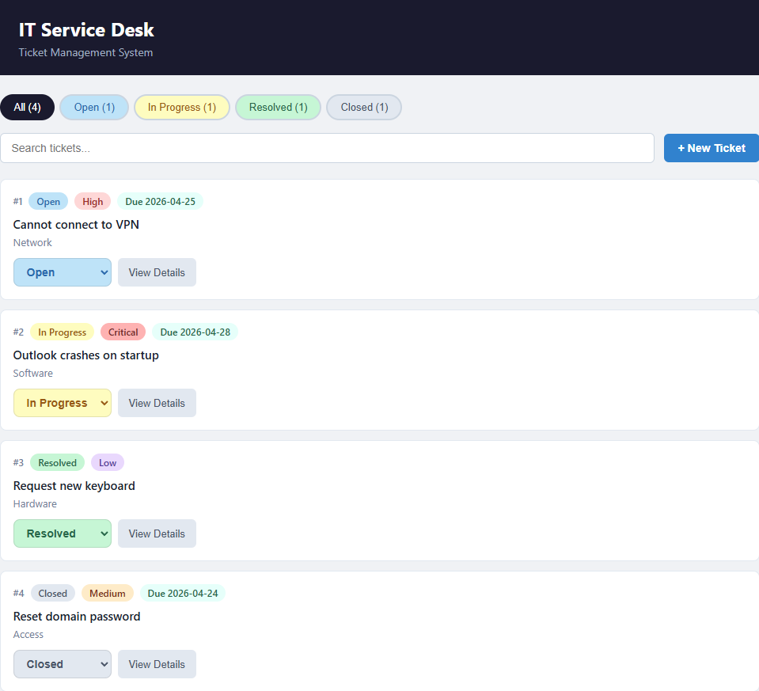
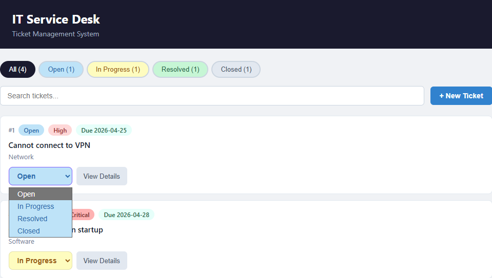
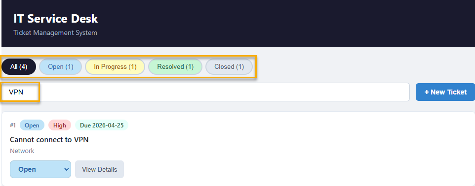
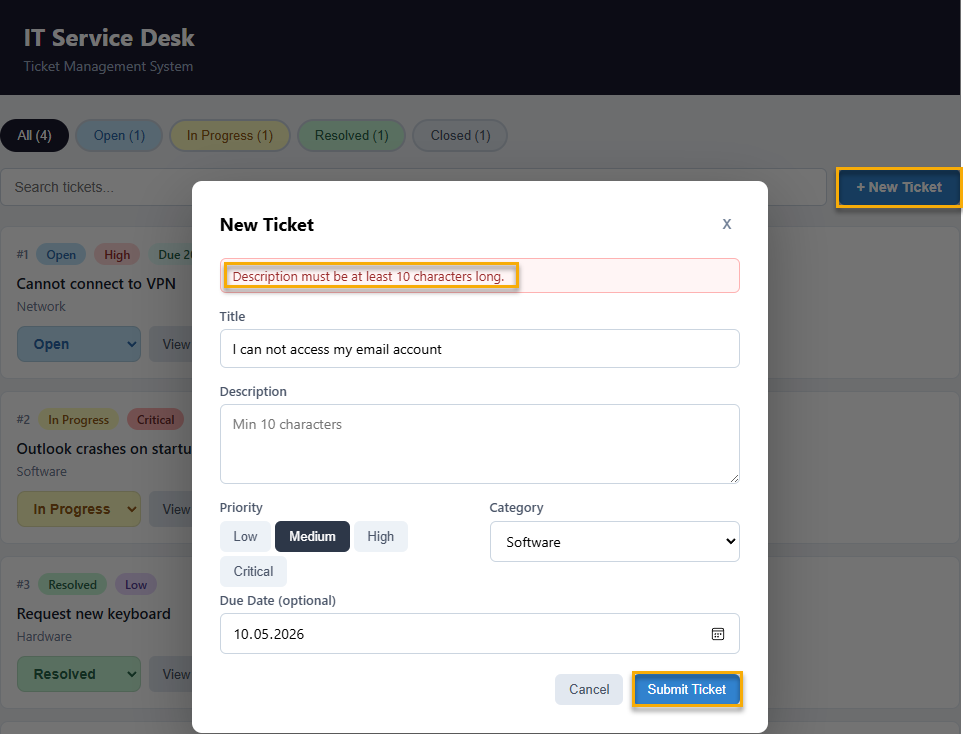
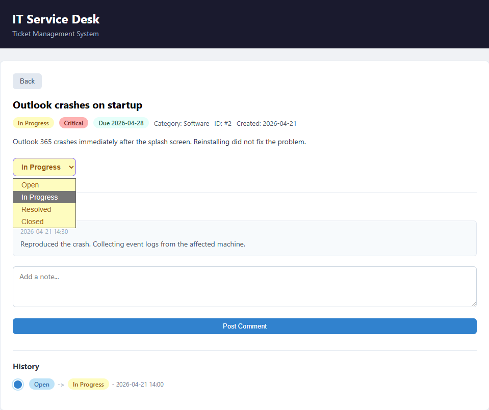
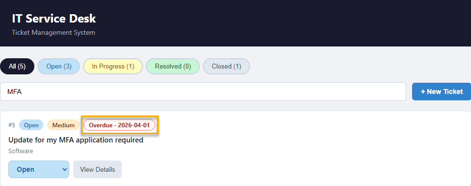
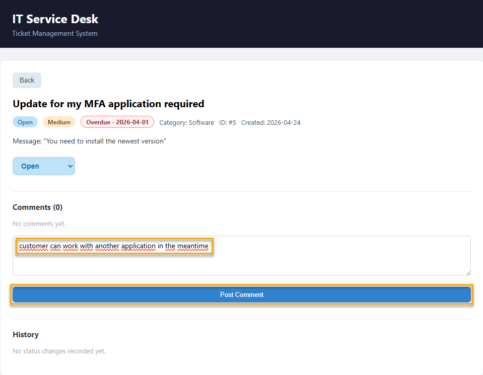
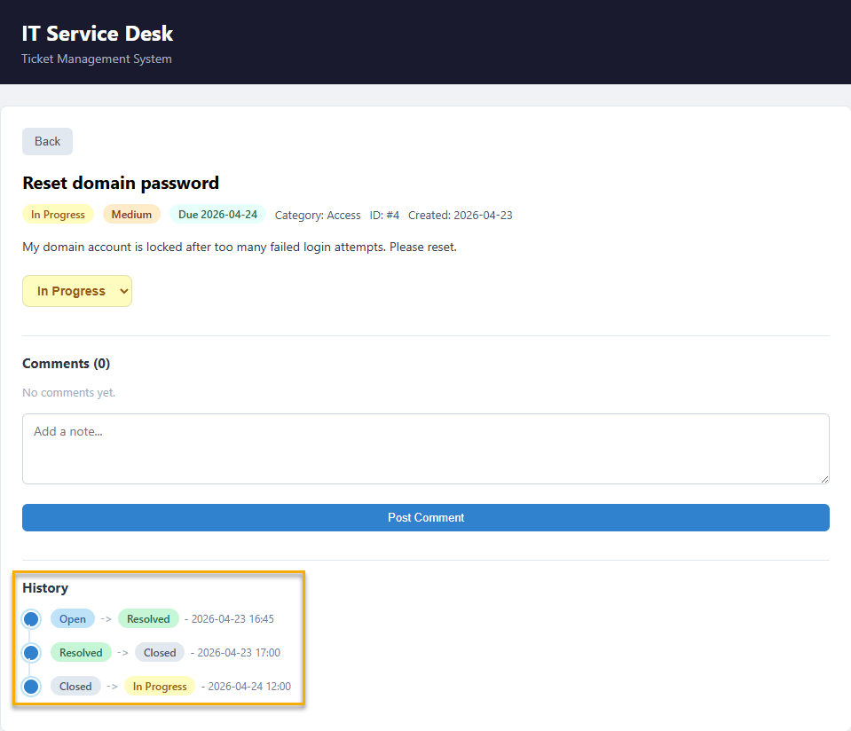

# Prototype Overview

## What is the Prototype?

The prototype is an IT Service Desk Ticket Management System built entirely in Elm. It runs in the browser with no backend, all data lives in the Elm model in memory. The application allows users to create support tickets, track their status across a defined lifecycle, filter and search the ticket list, view full ticket details, post comments, and inspect the history of every status change.

The prototype was chosen for three reasons.  
First, the ticket domain maps naturally onto The Elm Architecture: tickets are data in the Model, user interactions are Msg variants, status transitions and filtering logic are update branches, and the ticket list is a pure function of the model.  
Second, the domain is complex enough to demonstrate real Elm features, custom types for status and priority, exhaustive pattern matching, Maybe for optional fields, form validation, and list operations without requiring a backend or external API.  
Third, the application is immediately relatable to developers and students, which lowers the barrier to understanding the functionalities.



---

## How to Read This Documentation

This section is a walkthrough of the source code and is most useful when the prototype is running alongside it. Before reading further, it is recommended to open the prototype in your browser. The setup is straight forward and is covered in [prototype/README.md](../../prototype/README.md).

Once it is running, keep it open next to the documentation. The feature descriptions, data model explanations, and update logic all refer to things you can see and interact with directly. Reading this section without the prototype open is possible but loses most of its practical value.

If you prefer to explore interactively before reading the code walkthrough, jump to [Test Scenarios](05-test-scenarios.md) first and use it as a map. Each scenario names the Elm concept it demonstrates, so you can follow the scenarios in the browser and then return here to read how they work.

---

## Features

### Ticket list and navigation

The ticket list view shows all tickets and updates in real time as filters or search terms are applied. Each ticket card displays the ticket ID, title, status badge, priority badge, category, and an optional due date badge. A status dropdown on each card allows changing the ticket status without opening the detail view.



### Filtering and search

The filter toolbar allows narrowing the list by status All, Open, In Progress, Resolved, or Closed. Each button shows a live count of matching tickets. The search input filters by keyword across the ticket title and description simultaneously, and the results update on every keystroke without any button press.



### Create ticket form

The create ticket form opens as a modal overlay. It collects a title, description, priority, category, and an optional due date. Inline validation prevents submission if the title is shorter than five characters or the description is shorter than ten, and a clear error message is shown in both cases. On successful submission the form resets and the new ticket appears in the list.



### Ticket detail view

The detail view opens when the user clicks View Details on a ticket card. It shows the full ticket information including title, description, status, priority, category, ID, and creation date. A status dropdown in the detail view allows changing the status from this panel as well.



### Due date and overdue badge

The due date field is optional on every ticket. When a due date is set and the date has passed, the ticket card and detail view display a red overdue badge. When the date is in the future, a grey badge shows the deadline. This uses a string comparison against a hardcoded reference date, keeping the prototype free of the `elm/time` dependency.



### Comments

The comment system allows posting notes on any ticket from the detail view. Comments are appended to the ticket's comment list and displayed in chronological order with a timestamp. An empty comment cannot be submitted - the input is trimmed before the check and the model does not change if the result is empty.



### Status history timeline

Every status transition is recorded automatically. Each time a status changes, a history entry is appended to the ticket containing the previous status, the new status, and a timestamp. The detail view renders these entries as a vertical timeline with colour-coded status badges, giving a full audit trail of the ticket's lifecycle.



### Seed data

Four example tickets load on startup, one in each status so the application is immediately populated and all UI states are visible without creating tickets manually. Two of the seed tickets include pre-populated comments and history entries to demonstrate those features from the first load.

---

## What the Prototype Does Not Do

The following are intentional simplifications. They are deliberate choices to keep the prototype focused on demonstrating Elm's core features without adding setup friction.

There is no backend. All data is stored in the Elm model in memory and is lost on page reload. Connecting to a real API would introduce `elm/http` and `elm/json`, which are covered in [Example 05 - Weather App](../examples/05-weather-app/README.md) and described in [The Elm Architecture](../02-elm-theory/03-the-elm-architecture.md).

There is no persistent storage. A natural extension would be to save the ticket list to `localStorage` via ports, as demonstrated in [Example 04 - Ports and localStorage](../examples/04-ports-localstorage/README.md).

Timestamps are hardcoded strings. Without the `elm/time` package, creation dates and comment timestamps are static placeholders. This is noted in the source comments wherever timestamps appear.

There is no multi-page routing. The application is a single view with conditional rendering controlled by the model. Adding URL-based navigation would require `elm/url` and `Browser.application`.

---

## Source File Structure

The prototype is split across five source files. Each file has a single, clearly bounded responsibility, which reflects how a real Elm project would be organised and makes each file easier to reference from the documentation.

```
prototype/src/
├── Main.elm        # Entry point: wires together init, update, and view via Browser.sandbox
├── Types.elm       # All custom type definitions: TicketStatus, Priority, FilterState, Ticket, TicketComment, TicketHistoryEntry
├── Model.elm       # The Model record, the init function, and the seed ticket data
├── Msg.elm         # All Msg variant declarations with documentation comments
├── Update.elm      # The update function and all state transition logic
└── View.elm        # All view functions: rendering, filtering, form, detail, comments, history
```

The entry point `Main.elm` is intentionally minimal, it only wires the three TEA components together. All logic lives in the dedicated files above.

---

## Related Files

| File                                                  | Description                                  |
| ----------------------------------------------------- | -------------------------------------------- |
| [01 - Prototype Overview](01-prototype-overview.md)   | Application features and structure           |
| [02 - Data Model](02-data-model.md)                   | Types.elm and Model.elm walkthrough          |
| [03 - Messages and Update](03-messages-and-update.md) | Msg.elm and Update.elm walkthrough           |
| [04 - View](04-view.md)                               | View.elm walkthrough                         |
| [05 - Test Scenarios](05-test-scenarios.md)           | This file                                    |
| [Prototype README](../../prototype/README.md)         | Setup and run instructions for the prototype |
| [Prototype Source](../../prototype/src/)              | All Elm source files                         |

---

<sub>Previous | [Comparison Summary](../03-comparison/07-summary.md)</sub> &nbsp;&nbsp;&nbsp; <sub>Next | [Data Model](02-data-model.md)</sub>
