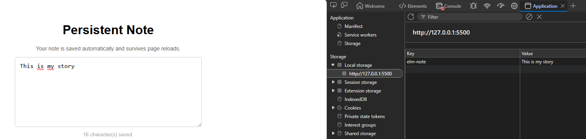

# Example 04 - Persistent Note (Ports and localStorage)

A note that survives page reloads using `localStorage`. It demonstrates **ports** - Elm's only mechanism for communicating with JavaScript - and explains why that boundary exists and what it costs.

## Run it locally (Ellie does not support ports)

Ellie has no access to a custom `index.html` and therefore cannot run this example.

**Just open `index.html` directly in your browser** - double-click it in your file explorer or drag it into a browser tab. No installation or compilation needed; the compiled `main.js` is already included in the repository.

`main.js` was generated from `Main.elm` using the following command and then committed to the repository:

```
elm make Main.elm --output=main.js
```

If you modify `Main.elm` and want to see your changes, you will need to re-run that command. This requires [Elm to be installed](https://guide.elm-lang.org/install/elm.html).

## What this example does

A single textarea where the user types a note.

- The note is **saved to `localStorage`** on every keystroke
- On **page reload**, the note is read back from `localStorage` and pre-filled into the textarea
- A character count below the textarea confirms how many characters are stored
- If nothing has been saved yet, a neutral message is shown instead

## Verify it is working

Type something into the textarea, then open your browser's DevTools to confirm the value is actually stored in localStorage.

**How to open DevTools:** press `F12` > go to the **Application** tab > expand **Storage > Local storage** > click the entry for your file.

You should see the key `elm-note` with your text as the value, exactly as shown below:



Try reloading the page - the note should reappear, confirming that the full round-trip through the ports works correctly.

## How the code is structured

### Why `Browser.element` instead of `Browser.sandbox`

The previous examples used `Browser.sandbox`. This example cannot - `sandbox` has no support for `Cmd` or `Sub`, which are required to use ports.

```elm
main =
    Browser.element
        { init = init
        , update = update
        , view = view
        , subscriptions = subscriptions   -- new: required for incoming ports
        }
```

`Browser.element` introduces two new concepts:

- `init` returns `(Model, Cmd Msg)` instead of just `Model`
- `update` returns `(Model, Cmd Msg)` instead of just `Model`
- A `subscriptions` function is required

### Ports: the explicit JS boundary

Ports are declared at the top of the file. The module must be declared `port module` instead of `module`.

```elm
port module Main exposing (main)
```

**Outgoing port** (Elm > JavaScript):

```elm
port saveNote : String -> Cmd msg
```

Calling `saveNote` from `update` produces a `Cmd`. The Elm runtime delivers it to the JS side asynchronously. On the JS side, a subscriber receives the value:

```javascript
app.ports.saveNote.subscribe(function (note) {
  localStorage.setItem("elm-note", note);
});
```

**Incoming port** (JavaScript > Elm):

```elm
port loadNote : (String -> msg) -> Sub msg
```

This produces a `Sub`. When JS calls `app.ports.loadNote.send(value)`, Elm receives it as a `Msg` via the subscription. In this example, JS sends the stored value once on startup:

```javascript
var stored = localStorage.getItem("elm-note") || "";
app.ports.loadNote.send(stored);
```

### Update: issuing a Cmd

```elm
update : Msg -> Model -> ( Model, Cmd Msg )
update msg model =
    case msg of
        NoteChanged newNote ->
            ( { model | note = newNote }, saveNote newNote )

        NoteLoaded stored ->
            ( { model | note = stored }, Cmd.none )
```

`NoteChanged` stores the new value in the model and sends it to JS via `saveNote`. `NoteLoaded` stores the value that arrived from JS on startup; no further command is needed.

### Subscriptions

```elm
subscriptions : Model -> Sub Msg
subscriptions _ =
    loadNote NoteLoaded
```

`loadNote NoteLoaded` tells Elm: whenever JS sends a value through the `loadNote` port, wrap it in a `NoteLoaded` message and deliver it to `update`. Without this subscription, JS sends would be silently ignored.

## The explicit boundary: why it exists

Elm cannot access `localStorage` directly. This is intentional. Elm's guarantee of no runtime errors holds only within its own type-checked code. Every interaction with the browser or with JavaScript is a potential source of untyped, unpredictable values. By routing all JS interop through ports, Elm enforces a clear contract: data that crosses the boundary must be declared, typed, and explicitly handled on both sides.

The analogy used in the Elm documentation is a foreign function interface (FFI). The boundary is not a workaround - it is the mechanism by which Elm keeps its safety guarantee intact even when the application must talk to an unsafe outside world.

## The trade-off

This is a real cost. Something that takes one line in JavaScript:

```javascript
localStorage.setItem("note", value);
```

takes two files and a message-passing protocol in Elm: a port declaration, a JS subscriber, a `Msg` variant, and a branch in `update`. The same pattern applies to WebSockets, third-party JS libraries, and any browser API Elm does not natively support.

Whether this cost is worth it depends on the project. For long-lived applications with complex state, the guarantee is valuable. For small utilities that are mostly glue code between browser APIs, the verbosity may not be justified.

## Key takeaway

Ports are the only way Elm communicates with JavaScript. The boundary is explicit, typed, and intentional - it is what allows Elm to maintain its no-runtime-errors guarantee even in applications that must interact with the outside world. The trade-off is a more verbose integration layer compared to JavaScript.

## Files

```
04-ports-localstorage/
├── elm.json    ← Elm project configuration (already set up, do not edit)
├── README.md   ← you are here
├── Main.elm    ← the Elm source (port module, Browser.element)
├── main.js     ← compiled output (regenerated by elm make, do not edit)
└── index.html  ← the HTML shell with JS glue code for both ports
```
